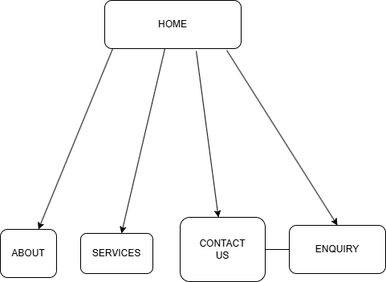
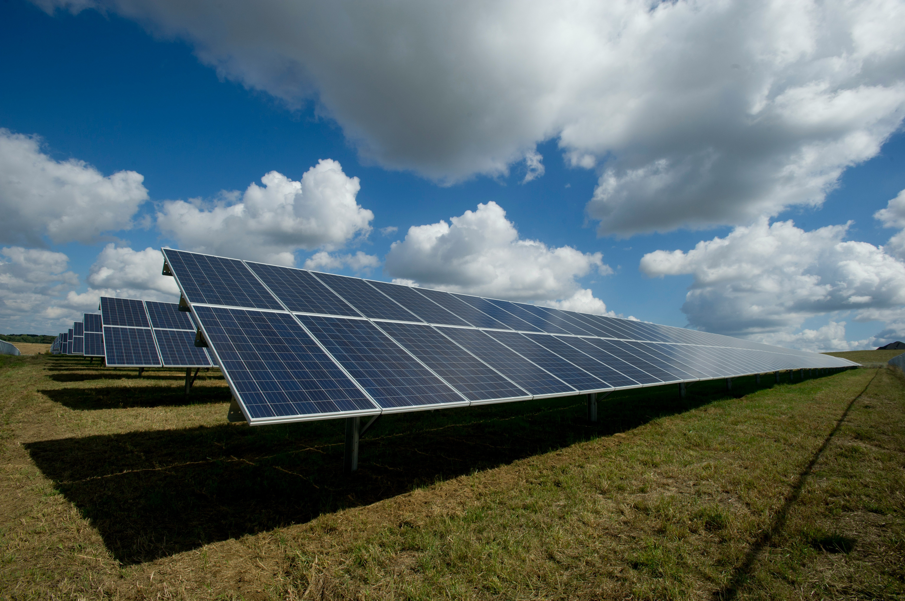

# Helios Solar Solutions — Website Portfolio (WEDE5020)

## Student Information
**Student Number:** ST10526279  
**Student Name:** Orapeleng Motau

---

## Project Overview

- **Business Name:** Helios Solar Solutions (Pty) Ltd.
- **Brief History:** Founded during the great load-shedding crisis in South Africa.
- **Target Market:** Middle to high-income homeowners in urban areas and small business owners looking to mitigate the impact of load-shedding and rising electricity costs.

Helios Solar Solutions is a specialised renewable energy provider based in South Africa. Founded in 2021, the company aims to address the growing need for energy independence in the face of rising utility costs and grid instability. The mission of Helios is to provide high-quality, sustainable energy transitions for residential and small commercial properties.

---

## Website Goals and Objectives

- **Primary Goal:** Establish professional credibility and generate qualified leads for custom solar installations.
- **KPI — Conversion Rate:** Achieve a 5% submission rate on the "Request a Quote" form.
- **KPI — Engagement:** A 2-minute average session duration as users browse the "How it Works" section.

---

## Timeline and Milestones

| Phase | Description | Status |
|-------|-------------|--------|
| Phase 1 (Planning) | Research and Proposal | Complete |
| Phase 2 (Structure) | HTML Content and Sitemap | Complete |
| Phase 3 (Design) | CSS Styling and Responsiveness | Complete |
| Phase 4 (Functionality) | JavaScript and Deployment | Upcoming |

---

## Sitemap



---

## Part 2 — CSS Styling and Responsiveness

### What was implemented

#### 1. External Stylesheet (`css/styles.css`)
A single external CSS file is linked to all five pages. It includes:

- **CSS Reset** — `box-sizing: border-box` and zeroed margins/padding for consistent cross-browser rendering.
- **CSS Custom Properties** — A `:root` block defines the colour palette, making the design easy to maintain.
- **Base Styles** — Default `font-family`, `font-size`, `line-height`, and `color` applied to `body`.

#### 2. Typography
- `font-family`: `'Segoe UI', Tahoma, Geneva, Verdana, sans-serif`
- Heading hierarchy styled with `font-size`, `font-weight`, `line-height`, and `letter-spacing` using `rem` units.
- Body text uses `1rem` base with `1.6` line height for readability.

#### 3. Layout Structure
- **Flexbox** used for the header (brand + navigation side by side) and the navigation list.
- **CSS Grid** used for the services cards (2-column on desktop), the company history timeline (2-column on desktop), and the contact details cards.
- `max-width` and `margin: 0 auto` used to centre content blocks on wide screens.

#### 4. Visual Styles
- Dark-green colour scheme (`#121912` background) with golden-orange (`#f4a015`) primary accents and bright-green (`#2ecc71`) secondary accents.
- `background-color`, `border`, `border-radius`, and `box-shadow` applied to cards.
- Interactive pseudo-classes on navigation links, buttons, and form fields:
  - `:hover` — colour shifts and `transform: translateY(-4px)` lift on cards.
  - `:focus` — visible outline for keyboard accessibility.
  - `:active` — pressed-state colour change on buttons.

#### 5. Responsive Design

Three breakpoints were defined using media queries:

| Breakpoint | Target | Key changes |
|------------|--------|-------------|
| `max-width: 1024px` | Tablet | Reduced font sizes, adjusted padding |
| `max-width: 768px` | Mobile | Single-column grid, stacked header, smaller nav |
| `max-width: 480px` | Small mobile | Vertical nav list, full-width buttons |

- **Relative units** (`rem`, `em`, `%`) used throughout for font sizes, spacing, and widths.
- Hero banner uses `width: 100%` and `height` defined per breakpoint via media queries.

#### 6. Responsive Images
The `srcset` and `sizes` attributes are applied to all banner images:

```html

```

`object-fit: cover` ensures the banner image crops gracefully at every screen size.

---

## Responsive Design Screenshots

> Screenshots captured using browser developer tools at desktop (1440px), tablet (768px), and mobile (375px) viewports.

*(Screenshot evidence to be included here)*

---

## Changelog

See [CHANGELOG.md](CHANGELOG.md) for the full version history.

---

## References

- YouTube. 2026. Available at: https://youtu.be/lI3iZ5xMII8?si=jAB-3bTbr3FAu3m2 [Accessed April 2026].
- Google Gemini. 2026. AI-assisted structural planning and wireframe logic for WEDE5020 Portfolio. [Large Language Model].
- Mozilla. 2026. MDN Web Docs: HTML Semantic Elements. Available at: https://developer.mozilla.org/en-US/docs/Glossary/Semantics [Accessed 18 April 2026].
- Pexels. 2026. Solar Panels on House Roof. Available at: https://www.pexels.com/search/solar%20panels/ [Accessed 19 April 2026].
- Mozilla. 2026. MDN Web Docs: CSS Media Queries. Available at: https://developer.mozilla.org/en-US/docs/Web/CSS/CSS_media_queries [Accessed May 2026].
- Mozilla. 2026. MDN Web Docs: CSS Flexbox. Available at: https://developer.mozilla.org/en-US/docs/Learn/CSS/CSS_layout/Flexbox [Accessed May 2026].
- Mozilla. 2026. MDN Web Docs: CSS Grid Layout. Available at: https://developer.mozilla.org/en-US/docs/Web/CSS/CSS_grid_layout [Accessed May 2026].
- Mozilla. 2026. MDN Web Docs: Responsive Images. Available at: https://developer.mozilla.org/en-US/docs/Learn/HTML/Multimedia_and_embedding/Responsive_images [Accessed May 2026].
- CSS-Tricks. 2026. A Complete Guide to Flexbox. Available at: https://css-tricks.com/snippets/css/a-guide-to-flexbox/ [Accessed May 2026].
- CSS-Tricks. 2026. A Complete Guide to CSS Grid. Available at: https://css-tricks.com/snippets/css/complete-guide-grid/ [Accessed May 2026].
